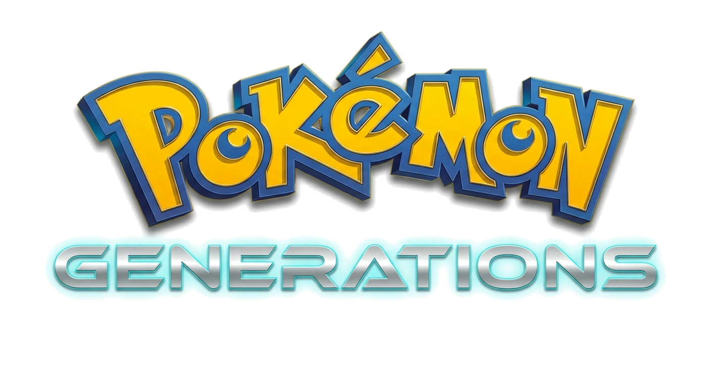

   
  
  
<b>Pokemon Generations Platform: battle sim, social hub, banking systems, and admin tooling.<b>

  

---

## Platform Apps

- **Pokemon Generations**: The main Flutter game client for roster management, battles, chat, mail, and progression.
- **Pokemon Center Admin**: The macOS operations console for build control, service health, logs, and release workflows.
- **Aevora Exchange**: The market and banking surface for dimensional asset tracking and economy operations.
- **pokemon_generations_backend**: The Node.js/Express backend powering auth, roster sync, battles, social systems, and banking.

## Features

- **Gen 9 Damage Engine**: Precision integer-math arithmetic following Smogon Scarlet/Violet standards.
- **Environmental Mastery**: Full support for real-time Weather (Rain, Sun, Sand, Snow) and Terrains.
- **Voice-Activated Combat**: Hands-free move execution using modern Speech-to-Text natural language processing.
- **Battle Replay Theatre**: Server-side storage (7-day TTL) for reviewing and sharing competitive strategies.
- **Real-Time Environment Sync**: Dynamic arena lighting and effects driven by local GPS and weather data.
- **Trainer ID Customization**: Create and share high-fidelity digital Trainer Cards with signature Pokémon and earned badges.
- **Physical/Special Split**: Accurate Generation 4-9 move classification and stat targeting.
- **Native App Promotion**: Smart detection for Android users to download the APK.
- **Dynamic Asset Streaming**: Real-time high-fidelity 3D models and animated sprite delivery.

---

## Flutter Client

The mobile and web client, built for performance and a premium editorial aesthetic.

### Architecture
- **State Management**: Riverpod (Generator-based)
- **Navigation**: GoRouter
- **Persistence**: Drift (SQLite) for high-performance offline data.
- **Networking**: Dio with specialized middle-ware for Pokémon telemetry.
- **Logic Layers**: Clean Architecture (Presentation -> Domain -> Data)

### Getting Started
**Prerequisites**: Flutter SDK (3.35.4+), Android Studio / Xcode.

1.  **Clone the repository** and navigate to the `/pokemon_generations` directory.
2.  **API Config**: Create `lib/core/config/api_keys.dart` and add your **OpenWeatherMap** key (Git ignored for security).
3.  **Dependencies**: Run `flutter pub get`.
4.  **Generators**: Run `dart run build_runner build --delete-conflicting-outputs`.
5.  **Run**: Launch via `flutter run` for your target platform.

### Connecting to a Backend
To sync with your private Node.js backend (e.g., a Mac mini home server):
1.  Identify the local IP of your server.
2.  In the app, navigate to **Settings**.
3.  Enter the server URL (e.g., `http://192.168.1.100:3000`) and tap **Test Connectivity**.

---

## Sources, APIs & Credits

Pokemon Generations is a community-driven platform built with a deep appreciation for the vast history of the Pokemon franchise.

### 🌩️ Data & Core APIs
- **[Pokemon Showdown](https://github.com/smogon/pokemon-showdown)**: The core engine for Pokémon data, moves, and battle mechanics.
- **[PokeAPI](https://pokeapi.co/)**: RESTful API for global Pokémon species metadata.
- **[TCGDex](https://www.tcgdex.net/)**: High-resolution Pokémon Trading Card Game image database.
- **[Smogon Damage Calc](https://github.com/smogon/damage-calc)**: Formula standards for competitive move effectiveness.
- **[OpenWeatherMap](https://openweathermap.org/)**: Real-time weather data for environmental battle synchronization.

### 🎨 Visual Assets & Sprites
- **[Smogon Sprite Project](https://www.smogon.com/forums/threads/smogon-sprite-project.3486712/)**: Animated battle GIFs for generations 1-9.
- **[Pokemon 3D API](https://github.com/Yizack/pokemon-3d-model-api)**: High-resolution GLB models for 3D arena rendering.
- **[PokeMiners](https://pokeminers.com/)**: High-res icons and assets extracted from the mobile ecosystem.
- **UI System**: Powered by **Space Grotesk** (Editorial) and **Manrope** (Body) typography.

### 🎵 Audio & Soundtrack
- **Official Soundtrack Archive**: Multi-region library from Kanto to Paldea.
- **[Cobblemon SFX](https://cobblemon.com/)**: High-fidelity move sound effects and UI audio cues.
- **Dynamic Variants**: Includes procedural `_night.mp3` variants for real-time atmosphere sync.

---

## ⚖️ Legal Status
Pokemon Generations is a non-profit, fan-made project created for educational and community-oriented purposes.

*Pokémon and all associated names, imagery, and trademarks are the property of Nintendo, Creatures Inc., and GAME FREAK Inc. This project is not affiliated with or endorsed by them.*
